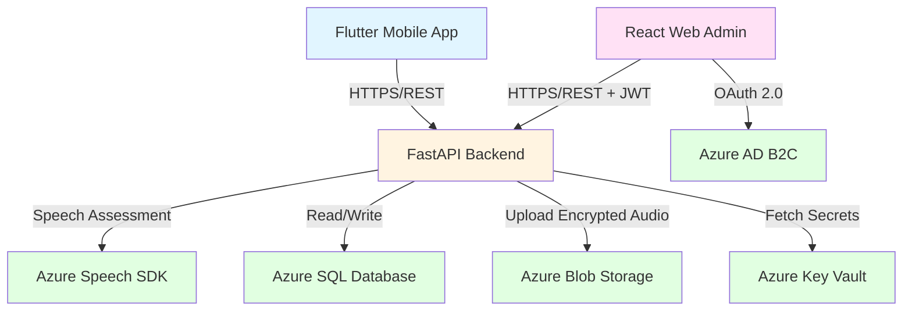

# PronIELTS Architecture Documentation

## System Overview

PronIELTS is a three-tier architecture system consisting of a mobile client, web admin interface, and a cloud-based backend with Azure services integration.

## Architecture Diagram



## Component Architecture

### 1. Mobile Client (Flutter)

**Responsibility**: User-facing pronunciation practice application

**Key Components**:
- **Screens Layer**: UI components for navigation
- **Provider Layer**: State management using Provider pattern
- **Services Layer**:
  - `ApiService`: REST API communication
  - `AudioService`: Microphone access and recording
  - `OfflineQueueService`: Hive-based offline queue
  - `EncryptionService`: Client-side encryption (optional)
- **Models Layer**: Data transfer objects

**Data Flow**:
1. User selects dialog and phrase
2. Records audio via `AudioService`
3. Audio sent to backend via `ApiService`
4. If offline, queued in Hive database
5. Scores displayed in results screen

**Technology**:
- Flutter 3.x (Dart)
- Provider for state management
- Hive for local storage
- Dio for HTTP requests
- record package for audio

### 2. Web Admin Client (React + TypeScript)

**Responsibility**: Content management and analytics dashboard

**Key Components**:
- **Pages**: Dashboard, Dialog Management, User Management
- **Components**: Reusable UI components
- **Services**: API client with Axios
- **Hooks**: Custom React hooks for data fetching (React Query)
- **Auth**: Azure AD B2C integration via MSAL

**Data Flow**:
1. Admin logs in via Azure AD B2C
2. MSAL acquires JWT token
3. Token attached to API requests
4. CRUD operations on dialogs/phrases
5. Dashboard fetches aggregated stats

**Technology**:
- React 18 + TypeScript
- Vite for build tooling
- React Router for routing
- React Query for server state
- Chart.js for analytics visualization

### 3. Backend API (FastAPI)

**Responsibility**: Business logic, data persistence, Azure services orchestration

**Layered Architecture**:

```
┌─────────────────────────────────────┐
│         API Layer (FastAPI)         │
│  /api/v1/assessments, /dialogs...   │
└─────────────────────────────────────┘
                 ↓
┌─────────────────────────────────────┐
│        Service Layer (SOLID)        │
│  SpeechAssessmentService            │
│  BlobStorageService                 │
│  EncryptionService                  │
└─────────────────────────────────────┘
                 ↓
┌─────────────────────────────────────┐
│      Data Access Layer (ORM)        │
│      SQLAlchemy Models              │
└─────────────────────────────────────┘
                 ↓
┌─────────────────────────────────────┐
│         Azure SQL Database          │
└─────────────────────────────────────┘
```

**Key Modules**:

1. **API Layer** (`app/api/v1/endpoints/`):
   - RESTful endpoints
   - Request validation (Pydantic)
   - Response serialization
   - Error handling

2. **Service Layer** (`app/services/`):
   - `SpeechAssessmentService`: Azure Speech SDK wrapper
   - `BlobStorageService`: File upload/download
   - `EncryptionService`: AES-256 encryption
   - `AssessmentService`: Business logic orchestration

3. **Data Layer** (`app/models/`, `app/db/`):
   - SQLAlchemy ORM models
   - Database session management
   - Alembic migrations

4. **Core** (`app/core/`):
   - Configuration management (Pydantic Settings)
   - Security utilities
   - Azure client initialization

**Technology**:
- FastAPI (Python 3.11+)
- SQLAlchemy + Alembic
- Azure SDK for Python
- Pydantic for validation
- Python-Jose for JWT

### 4. Azure Cloud Services

#### Azure Speech Service (F0 Tier)
- **Purpose**: Pronunciation assessment
- **Integration**: Azure Cognitive Services Speech SDK
- **Features Used**:
  - Pronunciation assessment (IELTS grading system)
  - Phoneme-level accuracy
  - Prosody assessment
  - Word-level error detection
- **Fallback**: Mock service for local development

#### Azure SQL Database (Basic Tier)
- **Purpose**: Persistent data storage
- **Schema**: Users, Dialogs, Phrases, Assessments
- **Features**:
  - ACID compliance
  - Foreign key constraints
  - JSON column support for detailed scores
  - Indexed queries for performance
- **Local Dev**: PostgreSQL 15 (Docker)

#### Azure Blob Storage (LRS)
- **Purpose**: Encrypted audio file storage
- **Container**: `audio-recordings`
- **Encryption**: Client-side AES-256 before upload
- **Access**: SAS tokens for time-limited access
- **Local Dev**: MinIO (S3-compatible)

#### Azure Key Vault
- **Purpose**: Secrets management
- **Stored Secrets**:
  - Speech API key
  - Database connection string
  - Blob storage connection string
  - Encryption keys
  - JWT secret

#### Azure AD B2C
- **Purpose**: Web admin authentication
- **Features**:
  - OAuth 2.0 / OpenID Connect
  - Social login (optional)
  - User management
  - JWT token issuance

## Design Patterns

### 1. Repository Pattern
- Service layer abstracts data access
- Enables easy mocking for tests
- Supports multiple data sources

### 2. Dependency Injection
- FastAPI's `Depends()` for service injection
- Facilitates testing and loose coupling

### 3. Strategy Pattern
- Mock vs Azure mode switching
- Configurable via environment variable

### 4. Observer Pattern
- Flutter Provider for reactive state management
- Notifies UI of state changes

### 5. Singleton Pattern
- Database session factory
- Azure client instances

## Data Flow: Assessment Submission

```
┌──────────────┐
│ Mobile App   │
│              │
│ 1. User      │
│    records   │
│    audio     │
└──────┬───────┘
       │
       │ 2. POST /assess
       │    (multipart/form-data)
       ↓
┌──────────────┐
│ FastAPI      │
│ Endpoint     │
│              │
│ 3. Validate  │
│    input     │
└──────┬───────┘
       │
       │ 4. Get phrase from DB
       │
       ↓
┌──────────────┐
│ Speech       │
│ Service      │
│              │
│ 5. Assess    │
│    pronun-   │
│    ciation   │
└──────┬───────┘
       │
       │ 6. Return scores
       │
       ↓
┌──────────────┐
│ Encryption   │
│ Service      │
│              │
│ 7. Encrypt   │
│    audio     │
└──────┬───────┘
       │
       │ 8. Upload encrypted
       │
       ↓
┌──────────────┐
│ Blob         │
│ Service      │
│              │
│ 9. Store in  │
│    Azure     │
└──────┬───────┘
       │
       │ 10. Return blob URL
       │
       ↓
┌──────────────┐
│ Database     │
│              │
│ 11. Save     │
│     assess-  │
│     ment     │
└──────┬───────┘
       │
       │ 12. Return assessment ID
       │
       ↓
┌──────────────┐
│ Response     │
│              │
│ 13. JSON     │
│     with     │
│     scores   │
└──────────────┘
```

## Security Architecture

### Authentication & Authorization

**Mobile App**:
- Anonymous users (MVP)
- User identified by generated UUID
- No authentication required
- Future: Azure AD B2C integration

**Web Admin**:
- Azure AD B2C OAuth 2.0
- JWT tokens in Authorization header
- Token expiration: 1 hour
- Refresh token rotation

### Data Security

**At Rest**:
- Audio files encrypted with AES-256
- Database encrypted by Azure (Transparent Data Encryption)
- Secrets in Azure Key Vault

**In Transit**:
- HTTPS/TLS 1.2+ for all communication
- Certificate pinning (future enhancement)

**Input Validation**:
- Pydantic models for request validation
- File type and size validation
- SQL injection prevention (ORM)
- XSS prevention (React escaping)

### Network Security

- CORS configured for specific origins
- Rate limiting on endpoints
- API key rotation policy
- Azure NSG for resource isolation

## Scalability Considerations

### Current MVP (Single Instance)
- 1 App Service instance (F1 tier)
- Vertical scaling possible
- ~100 concurrent users

### Future Scaling Strategies

**Horizontal Scaling**:
- Add App Service instances
- Azure Load Balancer
- Auto-scaling based on CPU/memory

**Database Optimization**:
- Connection pooling
- Read replicas for analytics
- Caching layer (Redis)

**CDN Integration**:
- Static assets on Azure CDN
- Reduced latency globally

**Microservices** (Future):
- Separate speech assessment service
- Independent scaling of components

## Monitoring & Observability

### Application Insights
- Request tracking
- Exception logging
- Performance metrics
- Custom events

### Metrics to Monitor
- API response time (< 10s target)
- Error rate (< 1% target)
- Speech SDK success rate
- Database query time
- Blob upload latency

### Alerts
- API downtime
- Error spike (> 5% rate)
- Database connection failures
- Speech quota approaching limit

## Disaster Recovery

### Backup Strategy
- Database: Daily automated backups (Azure SQL)
- Audio files: Geo-redundant storage (optional)
- Retention: 30 days

### RTO/RPO
- RTO (Recovery Time Objective): < 4 hours
- RPO (Recovery Point Objective): < 24 hours

### Failure Scenarios

**Speech SDK Failure**:
- Return cached score (if available)
- Queue for retry
- Notify admin

**Database Failure**:
- Use Azure SQL failover
- Mobile app uses offline queue
- Web admin shows maintenance page

**Blob Storage Failure**:
- Skip audio upload
- Save assessment without audio URL
- Retry upload later

## Development & Deployment

### Environments

1. **Local Development**:
   - Docker Compose (PostgreSQL, MinIO)
   - Mock Azure services
   - Hot reload enabled

2. **Azure Development**:
   - Separate resource group
   - Free tier services
   - Shared by team

3. **Production**:
   - Dedicated resource group
   - Scaled services
   - Monitoring enabled

### CI/CD Pipeline

```
Code Push → GitHub Actions
              │
              ├─> Run Tests
              │
              ├─> Build (Docker/Flutter/React)
              │
              ├─> Security Scan
              │
              └─> Deploy to Azure
                     │
                     ├─> Backend (App Service)
                     ├─> Web (Static Web Apps)
                     └─> Infrastructure (Terraform)
```

### Deployment Strategy
- Blue-Green deployment for backend
- Rolling updates for App Service
- Database migrations before deployment
- Rollback plan documented

## Technology Decisions & Rationale

### Why FastAPI?
- ✅ Modern Python framework
- ✅ Automatic API docs (OpenAPI)
- ✅ Built-in validation (Pydantic)
- ✅ Async support for better performance
- ✅ Easy dependency injection

### Why Flutter?
- ✅ Single codebase for iOS + Android
- ✅ Excellent audio plugin ecosystem
- ✅ Native performance
- ✅ Hot reload for fast development
- ✅ Material Design out of the box

### Why Azure SQL vs Cosmos DB?
- ✅ Structured data with relationships
- ✅ Complex queries for analytics
- ✅ Better free tier (32GB vs 25GB)
- ✅ ACID compliance
- ✅ Familiar SQL syntax

### Why Provider vs Riverpod/Bloc?
- ✅ Simpler learning curve
- ✅ Official Flutter recommendation
- ✅ Good enough for MVP complexity
- ✅ Easy migration to Riverpod later

## Future Architecture Evolution

### Phase 2 (Next 3 months)
- Add Redis caching layer
- Implement WebSocket for real-time feedback
- Separate speech assessment microservice
- Add CDN for static assets

### Phase 3 (6-12 months)
- Microservices architecture
- Event-driven with Azure Service Bus
- Machine learning model for personalized feedback
- Multi-region deployment

---

**Document Version**: 1.0
**Last Updated**: 2026-01-23
**Author**: Development Team
