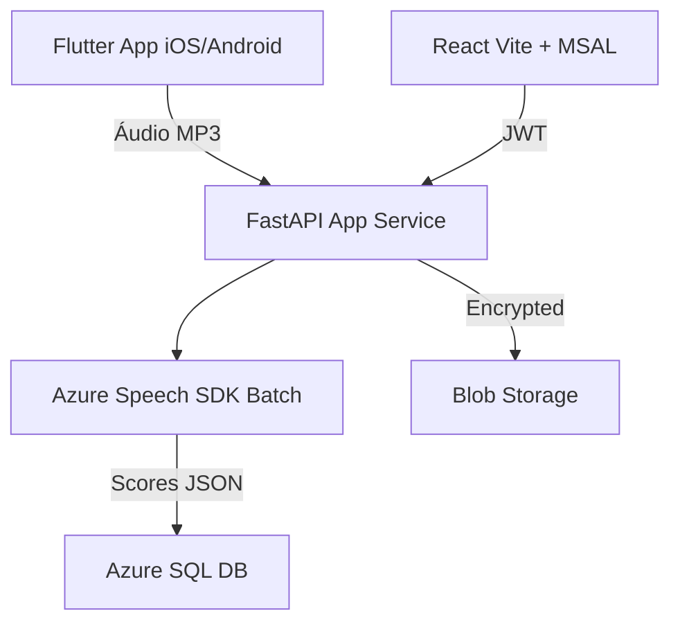

# Documentos de Engenharia de Software: App Avaliação Pronúncia Inglês (IELTS Focus)

## Visão Geral
App multiplataforma para avaliação de pronúncia em palavras/frases/prosódia IELTS-like. Stack: Flutter mobile, Python FastAPI backend, React TS web admin. Infra 100% Azure.

**Métricas Principais** (escolhidas para palavras/frases/prosódia):
- **Accuracy**: % fonemas/palavras corretos [IELTS Band correlation].
- **Prosody**: Score ritmo/entonação (0-5).
- **Fluency**: Pausas/velocidade (palavras/min).
- **Completeness**: % texto referenciado reconhecido.
- **Overall Score**: 0-100 agregado.

Diálogos temáticos: Profissional (tech jobs), Viagem, Geral, Restaurante, IELTS Parts 1-3.

## Arquitetura High-Level
```
Flutter Mobile ──POST /assess──> FastAPI Backend (Azure App Service)
                          │
                          ├── Azure Speech Batch API
                          ├── Azure SQL Database (scores, diálogos)
                          └── Blob Storage (áudios AES-256)
React Web Admin ──Azure AD B2C──> Backend (CRUD)
```

Diagrama:


**Banco Escolhido: Azure SQL Database**
- **Por quê melhor?** Estruturado (tabelas para diálogos/phrases, histórico assessments), queries complexas (progresso user), escalável, integra nativo Azure AD auth. Cosmos DB (NoSQL) free tier limitado (1000 RU/s, 25GB); SQL free tier: 32GB storage, 100k vCore-seconds/dia (~10M rows reads), ilimitado tempo.[web:48]
- Tabelas: `Users`, `Dialogs`, `Phrases`, `Assessments` (user_id, scores JSON, audio_blob_url).

## SRS - Requisitos
### Funcionais (MVP)
1. Mobile: Selecione diálogo → veja frase → grave (5-60s) → scores + feedback.
2. Web: CRUD diálogos/phrases, dashboard user (gráficos Chart.js).
3. Backend: Batch Azure Speech (ref_text → accuracy/prosody), salve SQL + blob.
### Não-Funcionais
- Segurança: Client-side encrypt (crypto-js Flutter), server-side Azure Disk Encryption.
- Performance: <10s response, batch mode.
- Offline: Queue local (Hive Flutter).

## Deploy Azure (Free Tier Inicial)
1. Speech Service (F0: 5h/mês free).
2. SQL Database (Basic free: 5 DTUs, 32GB).
3. App Service (F1 free: 1GB RAM, 60 CPU min/dia).
4. Blob (5GB free LRS).
5. Key Vault (free), AD B2C (free até 50k MAU).

## Plano Desenvolvimento (2 Semanas)
1. Dia 1-2: Azure setup + FastAPI boilerplate.
2. Dia 3-5: Flutter record/upload + SQL schema.
3. Dia 6-8: React admin + auth.
4. Dia 9-10: Cripto, testes, deploy.

## Código Boilerplate Backend (FastAPI + Azure SQL)
```python
# requirements.txt: fastapi uvicorn azure-ai-speech pyodbc azure-identity sqlalchemy

from fastapi import FastAPI, UploadFile, Form, Depends
from sqlalchemy import create_engine, Column, String, JSON, Integer
from sqlalchemy.ext.declarative import declarative_base
from sqlalchemy.orm import sessionmaker
import azure.ai.speech as speechsdk
import io
import os
from cryptography.fernet import Fernet  # Para encrypt local

app = FastAPI()
Base = declarative_base()

# SQLAlchemy Azure SQL (use managed identity)
DATABASE_URL = "mssql+pyodbc://yourserver.database.windows.net/db?driver=ODBC+Driver+18+for+SQL+Server&trusted_connection=no&auth=Default"
engine = create_engine(DATABASE_URL)
SessionLocal = sessionmaker(bind=engine)

class Assessment(Base):
    __tablename__ = 'Assessments'
    id = Column(Integer, primary_key=True)
    user_id = Column(String)
    reference_text = Column(String)
    scores = Column(JSON)  # {'accuracy':85, 'prosody':4.2}
    audio_url = Column(String)

# Dependency
def get_db():
    db = SessionLocal()
    try: yield db
    finally: db.close()

@app.post('/assess')
async def assess(audio: UploadFile = File(...), reference_text: str = Form(...), db: Session = Depends(get_db)):
    # Salva temp audio
    audio_bytes = await audio.read()

    # Azure Speech Batch (simplificado; use AudioConfig.from_stream)
    speech_config = speechsdk.SpeechConfig(subscription=os.getenv('SPEECH_KEY'), region='brazilsouth')
    pron_config = speechsdk.PronunciationAssessmentConfig(
        reference_text=reference_text, grading_system=speechsdk.PronunciationAssessmentGradingSystem.IELTS,
        granularity=speechsdk.PronunciationAssessmentGranularity.Word, enable_miscue=True)

    audio_input = speechsdk.audio.AudioConfig(stream=io.BytesIO(audio_bytes))
    recognizer = speechsdk.SpeechRecognizer(speech_config=speech_config, audio_config=audio_input)
    result = recognizer.recognize_once_pronunciation(pron_config)

    scores = {
        'accuracy': result.pronunciation_assessment_result.accuracy_score * 100,
        'prosody': result.pronunciation_assessment_result.prosody_score * 100,
        'fluency': result.pronunciation_assessment_result.fluency_score * 100,
        'overall': result.pronunciation_assessment_result.completeness_score * 100  # Ajuste
    }

    # Salva SQL
    assessment = Assessment(user_id='demo', reference_text=reference_text, scores=scores, audio_url='blob_url')
    db.add(assessment)
    db.commit()

    return scores

@app.get('/dialogs')
def get_dialogs(db: Session = Depends(get_db)):
    # Query SQL para diálogos
    return [{'type': 'Profissional', 'phrases': ['Describe Snowflake in data pipelines.']}]
```

**Flutter Snippet (record_audio.dart)**:
```dart
import 'package:record/record.dart';
import 'package:http/http.dart' as http;

// Record → POST multipart
Future<Map<String, dynamic>> assess(String text) async {
  final record = Record();
  await record.start();
  await Future.delayed(Duration(seconds: 10));
  var audioBytes = await record.stop();
  var request = http.MultipartRequest('POST', Uri.parse('https://yourapp.azurewebsites.net/assess'))
    ..fields['reference_text'] = text
    ..files.add(http.MultipartFile.fromBytes('audio', audioBytes!));
  var response = await request.send();
  return json.decode(await response.stream.bytesToString());
}
```

**Schema SQL (rode no Azure Portal)**:
```sql
CREATE TABLE Assessments (
    id INT IDENTITY PRIMARY KEY,
    user_id NVARCHAR(50),
    reference_text NVARCHAR(500),
    scores NVARCHAR(MAX),  -- JSON
    audio_url NVARCHAR(500),
    created_at DATETIME DEFAULT GETDATE()
);
```

## Prompt para Claude AI Code (Copie/Use)
```
Você é um engenheiro sênior Python/Flutter/React. Desenvolva MVP completo baseado neste spec MD:

[COLE TODO O CONTEÚDO ACIMA]

Foco inicial:
1. Backend FastAPI full com Azure Speech batch real (inclua encrypt audio antes Blob).
2. Flutter app: home com tabs diálogos (Profissional/Viagem/etc hardcoded 5 frases cada), record button, scores screen com gauges.
3. React Vite app: login Azure AD B2C, lista diálogos CRUD.

Use best practices: env vars, error handling, loading states. Forneça zip repo GitHub ready com README deploy Azure free tier.

Meu stack: macOS, VSCode Neovim, Python expert, IELTS speaking practice.
```

---
*Gerado por Perplexity AI em 23/Jan/2026. Baixe este .md para histórico.*
